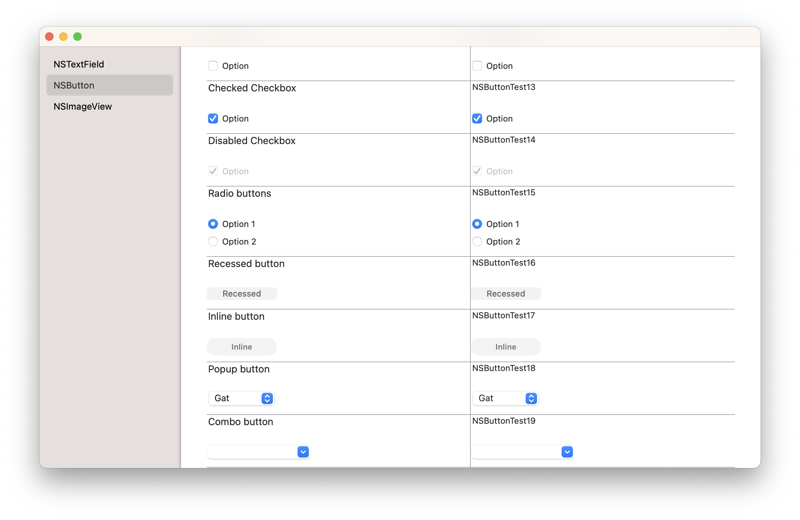
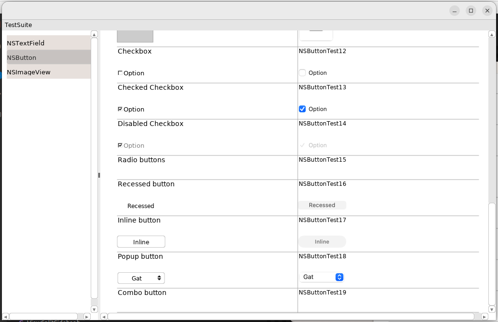

# Darling-TestSuite

Darling-TestSuite is an application to check the functionality of some AppKit components in Darling HQ.

The left column is rendered using the application's graphics engine, the right column shows a screenshot taken by OSX itself. 

In the code itself there are TODOs with code snippets that work on OSX but break the Darling application.

## How to run

Install Darling HQ as usual: [Build Instructions](https://docs.darlinghq.org/build-instructions.html)


Install Command-line developer tools: [Installing Software](https://docs.darlinghq.org/installing-software.html)

Then, compile and run:

```
darling shell
./compile.sh
./TestSuite.app/TestSuite
```

To complie it on OSX:
```
./compile.sh
./TestSuite.app/TestSuite
```

## Screenshots

OSX Screenshot:


Darling Screenshot (April 2023):
